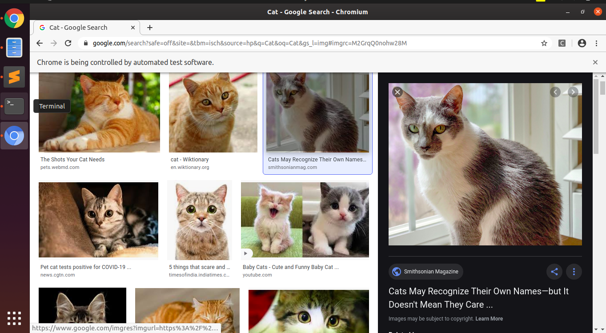
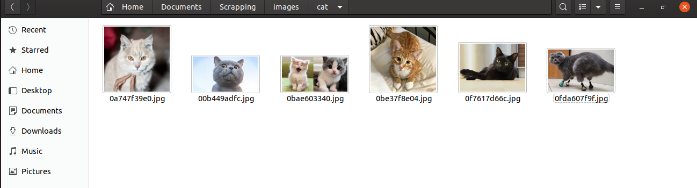

# Image-Scrapping-with-python-and-selenium
A python codebase that downloads images from Google Browser with the search term mentioned.

The above code base is written in python and downloads images from Google with the search term

## Table of contents

## Setup:

Steps for setting up Google Chrome browser driver:

1.Install Google Chrome (skip if its already installed).

2.Identify your Chrome version by typing below command. 
```
 $ google-chrome --version
 
```
and displays like this
```
  Google Chrome 81.0.4044.122
 
```

3.Download corresponding ChromeDriver from below link.
* <a href='https://chromedriver.chromium.org/downloads'>Google Chrome driver link</a><br>

4.Unzip the chromedriver.zip

5.Move the file to /usr/bin directory 
```
 $ sudo mv chromedriver /usr/bin
 
```
then move to below folder
```
 $ cd /usr/bin
 
```
6.Now, you would need to run something like
```
 $ sudo chmod a+x chromedrive
 
```
and mark it executable.

2.Steps to download required packages

1. Clone the code and open the terminal and type the following command
```
 $ bash requirements.sh
 
```
the above file will download all the required images

Running

After downloading the required packages
The code has two parts
1.Searching for a specific term & get image links
2.Downloading the images

The function find_and_download expects four input parameters:
search_term : Search term, like Cat
driver_path : instantiated Webdriver
target_path : images folder
number_images : No of images to download

Eg: find_and_download(search_term ="Cat", \
                        driver_path = "/usr/bin/chromedriver", \
                        target_path='./images', \
                        number_images=100)
                        
 Make the above changes in code and save it
 
 Finally run the below command to run the script
 ```
 $ python3 scrap_image.py
 
```
 After running the above code, the code automates to open Google browser as below
 <p align="center">
  
</p>
Then the images in stored in cat folder as below
<p align="center">
  
</p>
